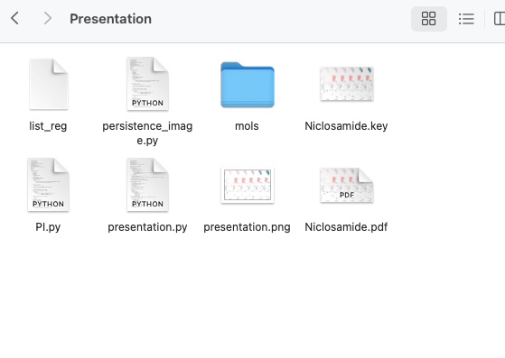

Persistent Homology to Predict the Physical Stability of Amorphous Drugs
==============

This is the code for paper Predictions of Glass-Forming Ability and Crystallization Tendency, contaning the calculated results corresponding to the figures in the paper and the Python code to show them.

About PCA
-----------------

The directory about\about_pca includes the theory, code, and demonstrations for performing PCA according to a specified variance explanation ratio. For more details, see About_the_PCA.pdf.

Classification Task
-----------------

The directory "Classification" contains Python code organized into three subdirectories, each handling a specific task: descriptor generation, model selection (for parameters), and training. Each subdirectory contains all the necessary code to perform its corresponding task. For more detailed information, please refer to the README file in each subdirectory.

Regression Task
-----------------

The directory "Regression" contains Python code organized into three subdirectories, each handling a specific task: descriptor generation, model selection (for parameters), and training. Each subdirectory contains all the necessary code to perform its corresponding task. For more detailed information, please refer to the README file in each subdirectory.

Descriptive Statistics on Persistent Homology
-----------------

The directory "DescriptiveStat" contains the Python code to get the descriptive statistics on persistent homology (PH), as well as plot the Figure 2 in the main text.

The "mol" folder contains molecular datasets used for calculations, sourced from the articles in the "ref" folder. The code "descriptive_stat.py" generates box plots for several features, including Persistent Entropy, Mean Barcode Length, Maximum Barcode Length, Number of Barcodes, Maximum Barcode Birth Time, Mean Barcode Death Time, and Barcode Lifetime.

Feature Importance Analysis
-----------------

This code is used to calculate the Shapley values corresponding to H0, H1, and H2 homology classes in order to determine the contribution of each homology class in the classification task. Please see README file for details. The code is written in MATLAB R2022a.

Demonstration of Persistent Homology
-----------------

The Python code to plot Figure 1 of the main text.

The demonstration of the point cloud, barcodes, persistence digram (PD) and persistent image (PI).

Plotting the Confusion Matrix and Scattergram.
-----------------

The Python code to plot the aesthetic confusion matrix (classification task) and the scattergram (regression task).

Reference
-----------------

The sources of the dataset are the papers "Computational Predictions of Glass-Forming Ability and Crystallization Tendency of Drug Molecules" and "Experimental and Computational Prediction of Glass Transition Temperature of Drugs." The previous state-of-the-art (SOTA) model was "Combining Machine Learning and Molecular Simulations to Predict the Stability of Amorphous Drugs," which has now been surpassed by this work. The "list_cc" file is the dataset, the "mols" is the conformation files of each molecule in the dataset are stored in XYZ format, and "xyz.zip" is its backup.

